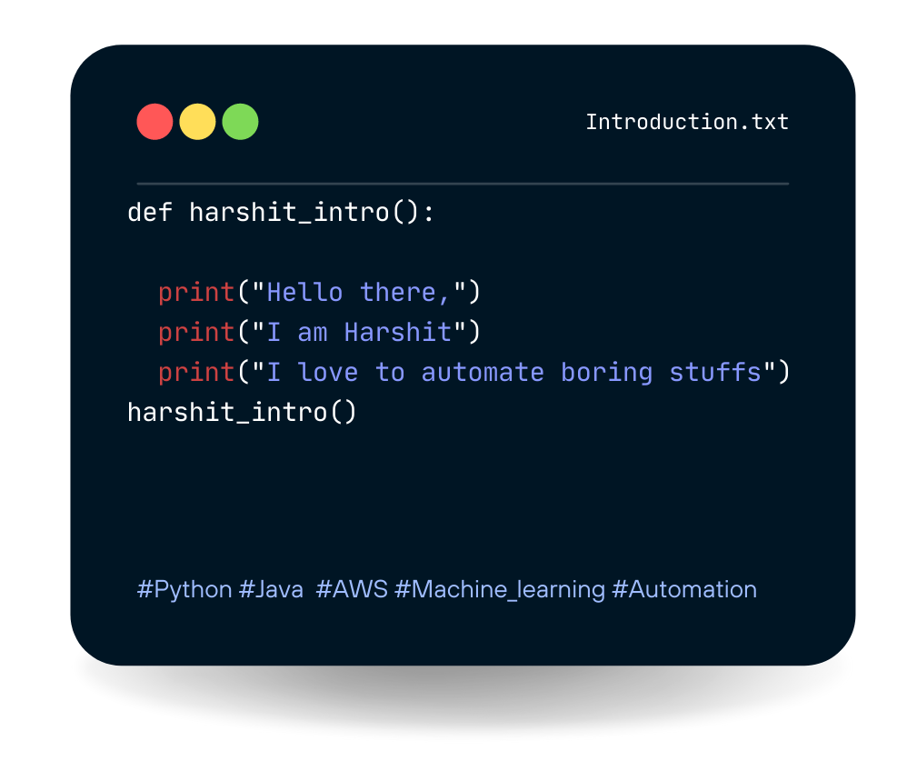
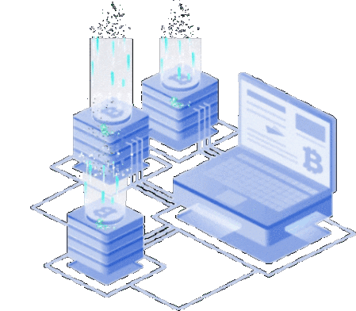

<h1 align="center">

   

<h1 align="center">Machine Learning Enthusiast </h1>

&nbsp;
-  &nbsp; I’m currently working on **Machine Leaning using AWS**

-  &nbsp;&nbsp; I like to **automate things in Python and explore new ML Algorithms**

-  &nbsp; Ask me about **Python, AWS, Machine Learning**

&nbsp;

<!-- connect with me -->
<h3 align="left">Connect with me:</h3>

<!-- coding profile -->
<h3 align="left">My coding profiles:</h3>

<!-- tech stack -->
<h3 align="left">My Tech Stack: </h3>

 
	 &ensp;
	&ensp;
	 &ensp;
	 &ensp;
	 &ensp;	
    

    

	<h3 align="left">GitHub Trophies:</h3>

  

<h3 align="left">My Github Stats:</h3>

&emsp; &emsp;&emsp;&emsp;&emsp;&emsp;&emsp;&emsp;&emsp;&emsp;

 

&nbsp;

 

&nbsp;

